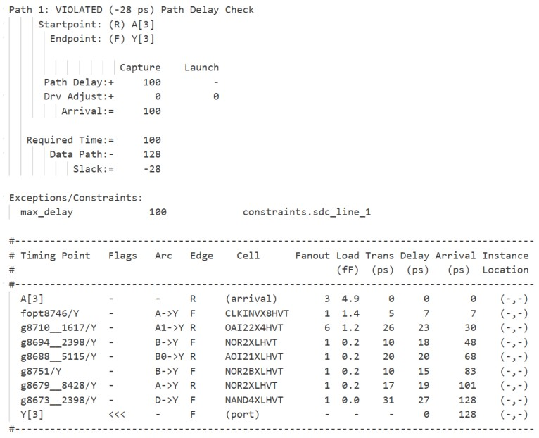
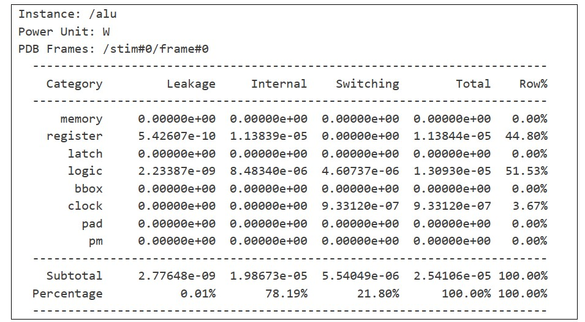
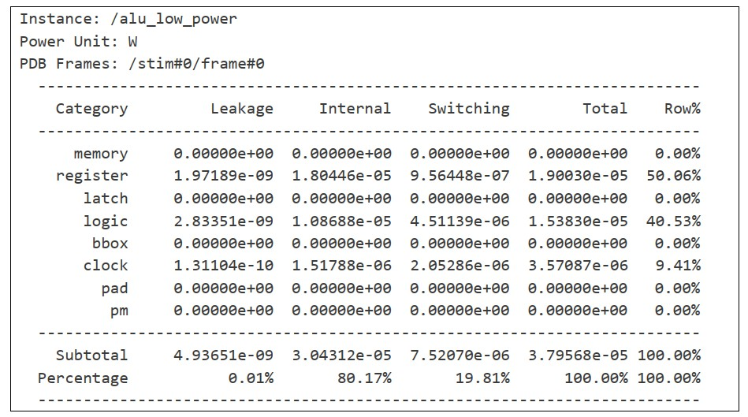
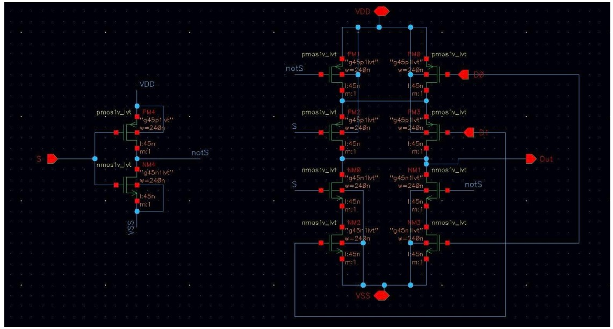

# Digital IC Design (45nm Technology)

## Project Overview
This repository demonstrates a **VLSI Design Flow**, ranging from **RTL Design** to **Layout** using the **GPDK 45nm** process technology.

The project simulates the complete lifecycle of standard cell design and digital system implementation, focusing on **Timing Analysis (STA)**, **Low-Power techniques (Clock Gating)**, and **DRC/LVS**.

**Key Achievements:**
* Designed and verified a multi-function **ALU** and **Accumulator** using SystemVerilog.
* Synthesized designs using **Cadence Genus** and optimized timing constraints (SDC).
* Implemented **Clock Gating** reducing total power consumption significantly.
* Designed Custom Schematics and Layouts for Standard Cells (Inverter, NAND, NOR, XOR, MUX).
* Achieved **DRC/LVS Clean** layouts using **Cadence Virtuoso Layout Suite XL**.

---

## Tools & Technologies
* **Front-end:** Cadence Xcelium (Simulation), SimVision (Debug), Cadence Genus (Synthesis).
* **Back-end:** Cadence Virtuoso Schematic Editor, Virtuoso Layout Suite XL, ADE L.
* **Verification:** PVS for DRC/LVS.
* **Language:** SystemVerilog, Tcl (Scripting).

---

## RTL to Synthesis & STA

### RTL Design & Verification
Designed an 8-bit Registered ALU capable of Addition, Subtraction, AND, XOR operations.
* **Feature:** Synchronous Reset, Flag generation (Overflow, Carry).
* **Verification:** Verified using constrained-random testbenches in Xcelium.

### Logic Synthesis & Optimization
Performed logic synthesis mapping RTL to the **45nm Standard Cell Library**.
* **Corner Analysis:** Analyzed Timing/Power/Area across multiple PVT corners.
* **Static Timing Analysis (STA):**
    * Defined clock constraints and I/O delays using SDC files.
    * Analyzed Critical Paths and Setup/Hold violations.

### Low Power Implementation (Clock Gating)
Implemented integrated **Clock Gating** cells to disable clock signals for inactive logic blocks.
* **Result:** Total power slightly increased compared to the baseline design (non-gated).
* Validated that for small-scale designs (4-bit ALU), the logic overhead exceeds the power savings. This confirms Clock Gating is most effective for larger datapaths

## Custom Circuit Design & Layout

### Transistor-Level Design (Schematic)
Designed CMOS schematics for fundamental logic gates: **Inverter, NAND, NOR, XOR, and 2:1 MUX**.
* Calculated W/L ratios to achieve symmetric Rise/Fall times ($t_r \approx t_f$) and $V_M \approx V_{DD}/2$.
* Performed DC Analysis (Voltage Transfer Characteristic) and Transient Simulation.

### Layout (The "Art" of IC Design)
Converted schematics into physical layouts adhering to **GPDK 45nm Design Rules**.
* **Strategy:** Minimized parasitic capacitance, shared diffusion areas (Euler paths), and ensured standard cell height compliance.
* **Verification:**
    * **DRC:** 100% Clean (No Design Rule Violations).
    * **LVS:** Matched (Layout matches Schematic netlist).
---
